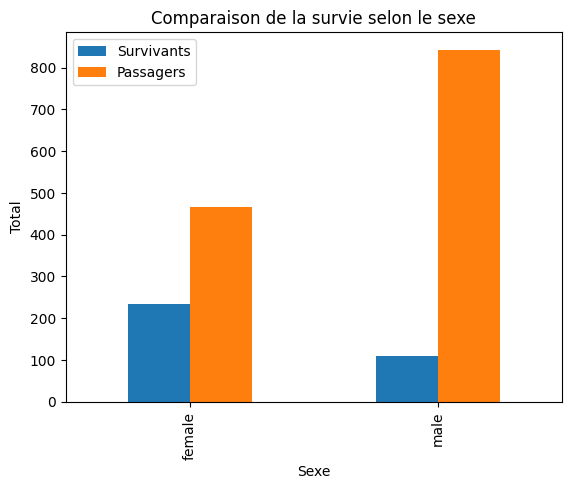
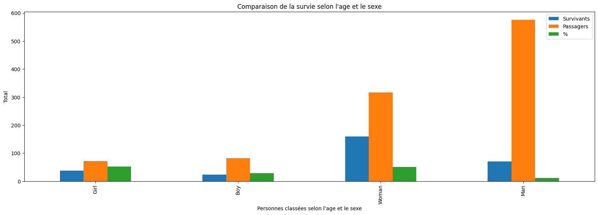
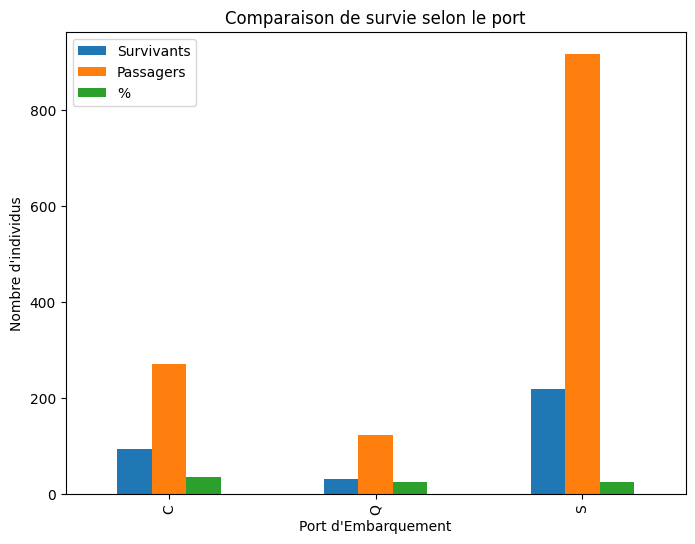
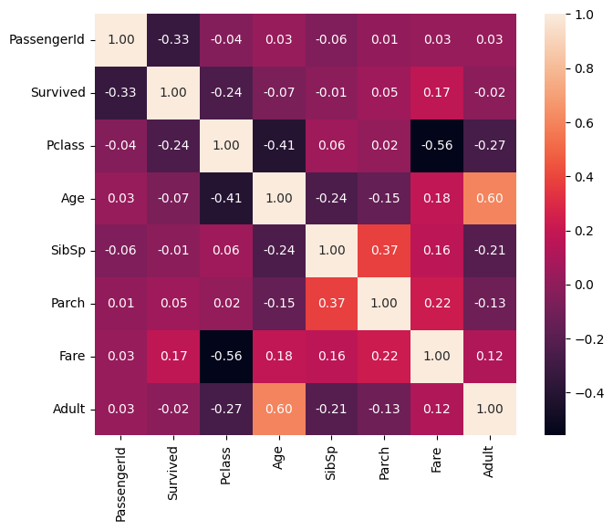

# TITANIC

## 📁Presentation de projet

--------
## 📌 Contexte

###### 
Nous utiliserons l'exemple du jeu de données du Titanic, un énorme paquebot pour l'époque qui fait naufrage en 1912 à la suite d'une collision avec un iceberg, lors de son voyage inaugural de Southampton à New York.

   * Nous avons accès à des informations sur une partie des passagers (1309 passagers) du Titanic. 
   * Pourquoi certains passagers ont survécu et d'autres sont morts?
   * Commencons l'analyse de données

##### 🔖 Les colonnes sont:

✔️ PassengerId : Passenger Id

✔️ Survived : True (1) / False (0)

✔️ Pclass : Passenger ticket class : Class 1, 2 and 3.

✔️ Name : Name of the passenger

✔️ Sex : Sex of the passenger male/female

✔️ Age : Age in years

✔️ Sibsp :	# of siblings / spouses aboard the Titanic	(il # heki nombre)

✔️ Parch	: # of parents / children aboard the Titanic	

✔️ Ticket :	Ticket number	

✔️ fare :	Passenger fare	

✔️ Cabin : Cabin number

-------

## 📌 Analyse
##### 🔖 Nous apprendrons à travailler avec les données en utilisant des bibliothèques libres populaires disponibles en Python : `numby` et `pandas` 
	✔️import pandas as pd
	✔️import numpy as np

##### Lecture des données du prix Nobel
######  📄 titanic = pd.read_csv('../mini-projet/Data/titanic.csv')
|    |   PassengerId |   Survived |   Pclass | Name                                                | Sex    |   Age |   SibSp |   Parch | Ticket           |    Fare | Cabin   | Embarked   |
|---:|--------------:|-----------:|---------:|:----------------------------------------------------|:-------|------:|--------:|--------:|:-----------------|--------:|:--------|:-----------|
|  0 |             1 |          0 |        3 | Braund, Mr. Owen Harris                             | male   |    22 |       1 |       0 | A/5 21171        |  7.25   | nan     | S          |
|  1 |             2 |          1 |        1 | Cumings, Mrs. John Bradley (Florence Briggs Thayer) | female |    38 |       1 |       0 | PC 17599         | 71.2833 | C85     | C          |
|  2 |             3 |          1 |        3 | Heikkinen, Miss. Laina                              | female |    26 |       0 |       0 | STON/O2. 3101282 |  7.925  | nan     | S          |
|  3 |             4 |          1 |        1 | Futrelle, Mrs. Jacques Heath (Lily May Peel)        | female |    35 |       1 |       0 | 113803           | 53.1    | C123    | S          |
|  4 |             5 |          0 |        3 | Allen, Mr. William Henry                            | male   |    35 |       0 |       0 | 373450           |  8.05   | nan     | S          |          

-------

#### Visualisation
###### Il faut utiliser la bibliothèque libre populaire disponible en Python : `matplotlib`
    ✔️import matplotlib.pyplot as plt
#### 📊 La comparison de survie selon le sex
   

#### 📊 La comparison de survie selon le sex et l'age
 
#### 📊 La comparison de survie selon le port

### Corrélation (point mathématique)
    ✔️pip install Jinja2
    ✔️Variante, avec "Seaborn": `pip install seaborn`
🖋️import `seaborn` as `sns`
🖋️`sns.heatmap`(titanic.corr(), fmt='0.2f', annot=True, square=True);

