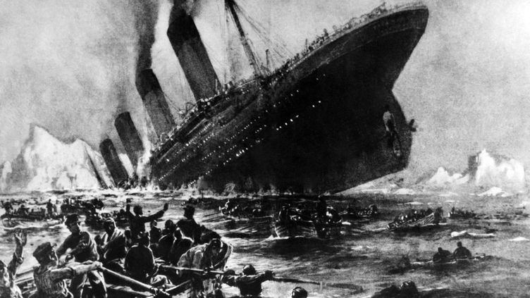

# mini-projet

## 📁Presentation de projet

--------
## 📌 Contexte

###### 
Nous utiliserons l'exemple du jeu de données du Titanic, un énorme paquebot pour l'époque qui fait naufrage en 1912 à la suite d'une collision avec un iceberg, lors de son voyage inaugural de Southampton à New York.

   * Nous avons accès à des informations sur une partie des passagers (1309 passagers) du Titanic. 
   * Pourquoi certains passagers ont survécu et d'autres sont morts?
   * Commencons l'analyse de données

##### 🔖 Les colonnes sont:

✔️ PassengerId : Passenger Id

✔️ Survived : True (1) / False (0)

✔️ Pclass : Passenger ticket class : Class 1, 2 and 3.

✔️ Name : Name of the passenger

✔️ Sex : Sex of the passenger male/female

✔️ Age : Age in years

✔️ Sibsp :	# of siblings / spouses aboard the Titanic	(il # heki nombre)

✔️ Parch	: # of parents / children aboard the Titanic	

✔️ Ticket :	Ticket number	

✔️ fare :	Passenger fare	

✔️ Cabin : Cabin number

-------

## 📌 Les étapes du projet
###### 1. Les prix Nobel
###### 2. Alors, qui reçoit le prix Nobel ?
###### 3. Domination des États-Unis
###### 4. La domination des États-Unis, visualisée
###### 5. Quel est le sexe d'un lauréat typique du prix Nobel ?
###### 6. Les premières femmes et hommes à remporter le Prix Nobel.
###### 7. Répéter les lauréats
###### 8. Lauréats du prix Nobel par âge
###### 9. Différences d'âge entre les catégories de prix
###### 10. Gagnants les plus âgés et les plus jeunes
###### 11. Nom du plus jeune gagnant !

## 📌 Analyse
##### 🔖 Nous apprendrons à travailler avec les données en utilisant des bibliothèques libres populaires disponibles en Python : `numby` `matplotlib` et `pandas` 
	✔️import pandas as pd
	✔️import seaborn as sns
	✔️import numpy as np

##### Lecture des données du prix Nobel
######  📄 nobel = pd.read_csv("./Data/nobel.csv")

|    |   year | category   | prize                                          | motivation                                                                                                                                                                                                                                         | prize_share   |   laureate_id | laureate_type   | full_name                    | birth_date   | birth_city        | birth_country    | sex   | organization_name   | organization_city   | organization_country   | death_date   | death_city   | death_country   |
|---:|-------:|:-----------|:-----------------------------------------------|:---------------------------------------------------------------------------------------------------------------------------------------------------------------------------------------------------------------------------------------------------|:--------------|--------------:|:----------------|:-----------------------------|:-------------|:------------------|:-----------------|:------|:--------------------|:--------------------|:-----------------------|:-------------|:-------------|:----------------|
|  0 |   1901 | Chemistry  | The Nobel Prize in Chemistry 1901              | "in recognition of the extraordinary services he has rendered by the discovery of the laws of chemical dynamics and osmotic pressure in solutions"                                                                                                 | 1/1           |           160 | Individual      | Jacobus Henricus van 't Hoff | 1852-08-30   | Rotterdam         | Netherlands      | Male  | Berlin University   | Berlin              | Germany                | 1911-03-01   | Berlin       | Germany         |
|  1 |   1901 | Literature | The Nobel Prize in Literature 1901             | "in special recognition of his poetic composition, which gives evidence of lofty idealism, artistic perfection and a rare combination of the qualities of both heart and intellect"                                                                | 1/1           |           569 | Individual      | Sully Prudhomme              | 1839-03-16   | Paris             | France           | Male  | nan                 | nan                 | nan                    | 1907-09-07   | Châtenay     | France          |
|  2 |   1901 | Medicine   | The Nobel Prize in Physiology or Medicine 1901 | "for his work on serum therapy, especially its application against diphtheria, by which he has opened a new road in the domain of medical science and thereby placed in the hands of the physician a victorious weapon against illness and deaths" | 1/1           |           293 | Individual      | Emil Adolf von Behring       | 1854-03-15   | Hansdorf (Lawice) | Prussia (Poland) | Male  | Marburg University  | Marburg             | Germany                | 1917-03-31   | Marburg      | Germany         |
|  3 |   1901 | Peace      | The Nobel Peace Prize 1901                     | nan                                                                                                                                                                                                                                                | 1/2           |           462 | Individual      | Jean Henry Dunant            | 1828-05-08   | Geneva            | Switzerland      | Male  | nan                 | nan                 | nan                    | 1910-10-30   | Heiden       | Switzerland     |
|  4 |   1901 | Peace      | The Nobel Peace Prize 1901                     | nan                                                                                                                                                                                                                                                | 1/2           |           463 | Individual      | Frédéric Passy               | 1822-05-20   | Paris             | France           | Male  | nan                 | nan                 | nan                    | 1912-06-12   | Paris        | France          

-------

#### 📊 La domination des États-Unis, visualisée
###### Pour voir quand les USA ont commencé à dominer les charts Nobel il faut une `plot`

------
#### 📊 Quel est le sexe d'un lauréat typique du prix Nobel ?
######  Ainsi, les États-Unis sont devenus le gagnant dominant du prix Nobel d’abord dans les années 1930 et avait gardé la position de leader depuis. Mais un groupe qui était en tête depuis le début, et qui ne semble jamais lâcher prise, ce sont les hommes. Cela ne devrait peut-être pas être un choc qu’il y ait un certain déséquilibre entre le nombre de lauréats masculins et féminins, mais quelle est l’importance de ce déséquilibre? Et est-il meilleur ou pire dans certaines catégories de prix comme la physique, la médecine, la littérature, etc.?
###### ✅ Répartition de la proportion de femmes lauréates par décennie par catégorie de prix.

###### ✅ Répartition de la proportion de hommes lauréates par décennie par catégorie de prix.

-------
#### 📊 Lauréats du prix Nobel par âge
###### Pour voir quel âge avaient les gagnants? Alor, il faut une `plot`

-------
#### 📊 Différences d'âge entre les catégories de prix
#### Examinons les tendances de l’âge dans différentes catégories de prix.

